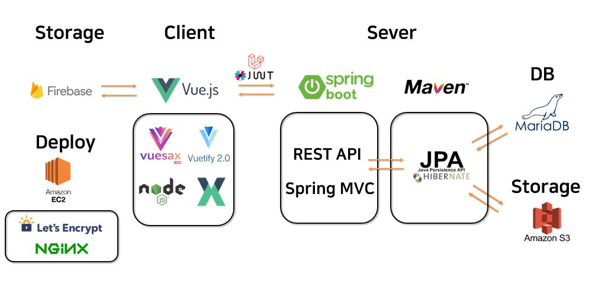

# Commitment

> Welcome to [Commit your moment](http://i4a308.p.ssafy.io/) :globe_with_meridians:

<br>

## Member :family:


### Contact :green_book:

박영철 [Github]() 🐹

강해성 [Github](https://github.com/Haesungkang) 🐶

박소현 [Github]() 🐱

김청화 [Github]() 🐯

박유정 [Github]() 🐭

<br>

## Project Summary 🧭

- Purpose

  Github의 잔디 심는 것에서 아이디어를 얻어와 탄생한 여행 기록 웹서비스입니다.

  전국을 여행다니며 우리나라 지도를 채우고, 도전과제를 수행하며 여행의 재미를 두배로 느낄수 있도록 제작하였습니다 .

  또한 나만의 지도를 자랑할 수 있게 SNS형태를 만들고, 위치기반으로 서로 소통할 수 있는 공간을 마련했습니다. 

  > Commitment ❔
  >
  >  Commit your mement의 줄임말 으로써 지금의 소중한 순간을 기록하자는 의미입니다. 

- Duration

  Jan 11th 2021 ~ Feb 19th 2021

- Results
  - [시연영상]()
  - [UCC]()
  - [최종발표]()

<br>

## Project Info :pushpin:

### Tech Stack 🧩



### Usage 🎈

#### Front-end

- Project Setup

  - ```bash
    $ npm install 
    ```
  
- Compiles and hot-reloads for development

  - ```bash
    $ npm run serve
    ```
  
- Compiles and minifies for production

  - ```bash
    $ npm run build
    ```
    
  
-  Run your tests

  - ```bash
    $ npm run test
    ```

-  Lints and fixes files

  - ```bash
    $ npm run lint
    ```

-  Customize configuration

  - [Configuration Reference](https://cli.vuejs.org/config/)

#### Back-end

**Install**

- Java (Open JDK 14)

- Maven

- VS Code with Spring Boot Extension Pack 

- Docker

  - Start Maria DB Container

    ```bash
    docker run --name-db -p 3306:3306 -e MYSQL_ROOT_PASSWORD={your_password} -d mariddb
    ```

    ```bash
    docker exec -it maria-db mysql -u root -p
    ```

  - Create DB table

### Database Modeling :link:

   

<br>

### Features :sparkles:

> 주요기능 소개 및 설명

- 커밋 지도

  - 현재위치를 기반으로 기록 저장가능
  - 기록만 하고 추후 게시글 및 이미지 게시가능

- 위치기반 SNS

  - 현재 위치를 기반으로 주변 게시글 확인 
  - 반경설정을 통해 원하는 위치까지 게시글 조회 

- 도전과제 & 랭킹

  - 각 지역별 & 기록수 기반으로 도전과제 수행가능 
  - 지역별 기록 전체 랭킹 조회
  - 내가 팔로우한 유저 기준으로 랭킹 확인 

- 타임라인

  - 자신의 기록을 타임라인으로 한눈에 확인 가능

    

<br>

### Pages in Detail :mag:

> 각 페이지별 소개

[Pages in Detail ](Document/Page_Details/Page_Details.md)

<br>

### Tech log :bookmark:

<details>
<summary>Personal Goal and Summary</summary>
    <ul>
        <a href="Document/Tech_Log/Personal_Goal/Personal_Goal.md"><li>개인목표정리</li></a>
        <a href="Document/Tech_Log/Personal_Goal/Develop_Summary_YoungChul.md"><li>박영철 개발일지</li></a>
        <a href="Document/Tech_Log/Personal_Goal/Develop_Summary_HaeSung.md"><li>강해성 개발일지</li></a>
        <a href="Document/Tech_Log/Personal_Goal/Develop_Summary_SoHyun.md"><li>박소현 개발일지</li></a>
        <a href="Document/Tech_Log/Personal_Goal/Develop_Summary_ChungHwa.md"><li>김청화 개발일지</li></a>
        <a href="Document/Tech_Log/Personal_Goal/Develop_Summary_YooJeong.md"><li>박유정 개발일지</li></a>
    </ul>
</details>
<details>
<summary>Scrum</summary>
    <ul>
        <a href="Document/Tech_Log/Scrum/1월4주차_회의록.md"><li>1월 4주차</li></a>
        <a href="Document/Tech_Log/Scrum/1월5주차_회의록.md"><li>1월 5주차</li></a>
    <a href="Document/Tech_Log/Scrum/2월1주차_회의록.md"><li>2월 1주차</li></a>
        <a href="Document/Tech_Log/Scrum/2월2주차_회의록.md"><li>2월 2주차</li></a>
        <a href="Document/Tech_Log/Scrum/2월3주차_회의록.md"><li>2월 3주차</li></a>
    </ul>
</details>
<details>
<summary>Project Proposal and WireFrame</summary>
    <ul>
        <a href="Document/Tech_Log/Project_Proposal/Project_Proposal.md"><li>프로젝트 기획안</li></a>
    <a href="https://www.figma.com/file/D5d31VoT1Q3PfwKHgMWRkX/SSAFY-project-1"><li>와이어프레임</li></a>
    </ul>
</details>
<details>
<summary>Video Proposal</summary>
    <ul>
        <a href="Document/Tech_Log/Video/Video_Proposal.md"><li>영상기획안</li></a>
    </ul>
</details>


